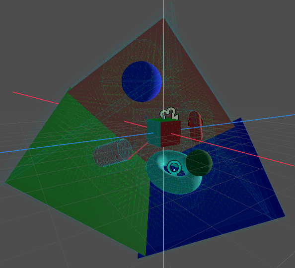

# Custom Gravity

[Watch an intro video on YouTube](https://youtu.be/_-COEjTrBX0)

Override and extend the standard physics gravity

## Introduction

Custom gravity should be used in place of the standard Area3D gravity. It reimplements the gravity system such that new types and interactions can be easily added.

## Getting Started

### Basic Setup

The gravity manager node should be auto-loaded on activating the plugin. Add a `GravityArea3D` node to your scene and give it one or more `CollisionShape3D` children to define the gravity area.

### Configuring Gravity Areas

**Gravity Resource**: Set the `Gravity Resource` property to define the type and behavior of gravity (Point, Cube, Cylinder, etc.). Each resource type has specific parameters for controlling the gravity field. By default a gravity area uses [point source gravity](#point).

**Gravity Strength**: The inherited `Gravity` property from Area3D acts as a multiplier for the gravity strength (default: 9.8).

**Priority and Override Modes**: Use the `Priority` and `Gravity Space Override` properties (inherited from Area3D) to control how multiple overlapping gravity areas interact. Higher priority areas take precedence. Override modes work the same as native Area3D gravity.

**Gravity Direction**: This native property of the native gravity system will cause conflicting behavior if left in place. Set to (0, 0, 0) with `Point` being false to fully disable native behavior.

### Interaction with Native Gravity

Custom gravity can be used in tandem with the native Godot gravity system. However, any interactions between custom and native gravity will always be additive. To override native gravity, you have two options:
* Remove standard gravity from your project: `Project > Physics > 3D > Default Gravity Vector = Vector3.ZERO`
* On any `GravityArea3D` with which you wish to override native gravity, set the `Area3D` property `Gravity Space Override` to `Replace` with `Gravity` set to 0.

### Character Bodies

`RigidBodies` will automatically interact with gravity areas. For `CharacterBody` scripts, you will need to query the `GravityManager.get_gravity(body)` method instead of calling the `CharacterBody` native `get_gravity()` method.

## Gravity Types

All gravity positions and directions are relative to their local transform, so do not need to be reconfigured if reoriented.

### Null

Useful as a placeholder or to create a zero-gravity area using priority override.

### Vector

Simply adds constant acceleration in a given direction.

### Point

A classic gravity well, can be inverted to push against the inside of a shell. Can either provide constant acceleration or will exponential dropoff.

### Cylinder

Pulls or pushes relative to an infinite line. Can either provide constant acceleration or will exponential dropoff.

### Capsule

Pulls or pushes relative to a finite line, with the caps acting like point gravity sources when 'outside' the start and end points. Can either provide constant acceleration or will exponential dropoff.

### Box

Pulls or pushes towards the shell of a cuboid. The edges act like cylinder gravity while the vertices act like point sources. This is more noticeable when putting the shell 'inside' the body so that the edges and corners aren't razor thin at the ground, or when using inverted mode.

### Torus

Pulls or pushes towards a circle, forming a torroidal zone. Can either provide constant acceleration or will exponential dropoff.

### Adding a New Type

Extend the `Gravity` type and give a useful name to the new type. The `get_gravity_at(position: Vector3) -> Vector3` function must be implemented, other than that have fun. What would a Perlin noise gravity field look like?

## Working with Complex Collision Shapes

For complex gravity areas with multiple convex collision shapes, this plugin includes an import script that automatically converts Blender meshes into `GravityArea3D` nodes.

### Workflow

1. **Generate Convex Decomposition**: Use [CoACD](https://github.com/SarahWeiii/CoACD/) to decompose your mesh into multiple convex hulls. The [Blender Convex Decomposition plugin](https://github.com/olitheolix/blender-convex-decomposition) provides a convenient interface for this.

2. **Name Your Meshes**: In Blender, ensure your convex hull meshes follow the `UCX_` naming convention (e.g., `UCX_Spiral_0`, `UCX_Spiral_1`, etc.). These should be children of a parent mesh with the `-colonly` suffix (e.g., `Spiral-colonly`).

3. **Apply Import Script**: In Godot, select your `.blend` file in the FileSystem panel, go to the Import tab, and set the **Import Script** path to `res://addons/custom_gravity/util/import_gravity_area.gd`. Click **Reimport**.

The import script will automatically:
- Create a `GravityArea3D` as the scene root
- Extract all collision shapes from `UCX_*` meshes
- Name each `CollisionShape3D` after its source mesh
- Remove unnecessary StaticBody3D and MeshInstance3D nodes

The result is a clean, ready-to-use `GravityArea3D` with all collision shapes as direct children.

## Gravity Modes

Gravity modes in this plugin are equivalent to the native gravity modes with one key difference. Instead of using the `Area3D` node's UID to break priority ties, the relative index location of nodes is used. The most recently entered node will always be the last member of the list of `GravityArea3D`s affecting a given body, allowing for a reliable and consistent behavior in line with certain popular adventure games with heavy gravity mechanics.

## Licenses

- Source code: [MIT License](/LICENSE).
- Godot logo: [CC BY 3.0](https://creativecommons.org/licenses/by/3.0/).
